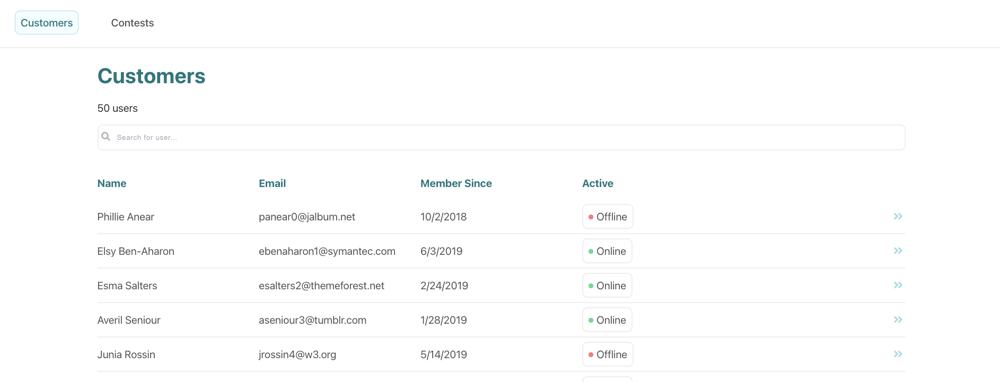

<h1 align="center">RadPoker Admin Panel Challenge</h1>

  <a href="https://radpoker.netlify.app/"><strong>View the Hosted Site »</strong></a>

Part of the challenge was to create a mock server. The mock API can be [viewed here](https://radpoker.herokuapp.com) and the endpoints are as follows.

`BASE URL - https://radpoker.herokuapp.com`

### Get All Customers

`GET /customers`

### Get Specific Customer Information and Their Accounts

`GET /customers/:id`

### Get Contest Information

Returns each contests with an additional array of objects called contestInfo that contains each user participating in that contest.

`GET /contests`

### Goals

* ✅   ~~If given more time, I would have liked to improve the search function to filter by more than just first name.~~
* I would have also liked to include more information on the contests page. Maybe how many players are actively online in addition to other information that might be helpful to know about contests such as prize money or duration. 